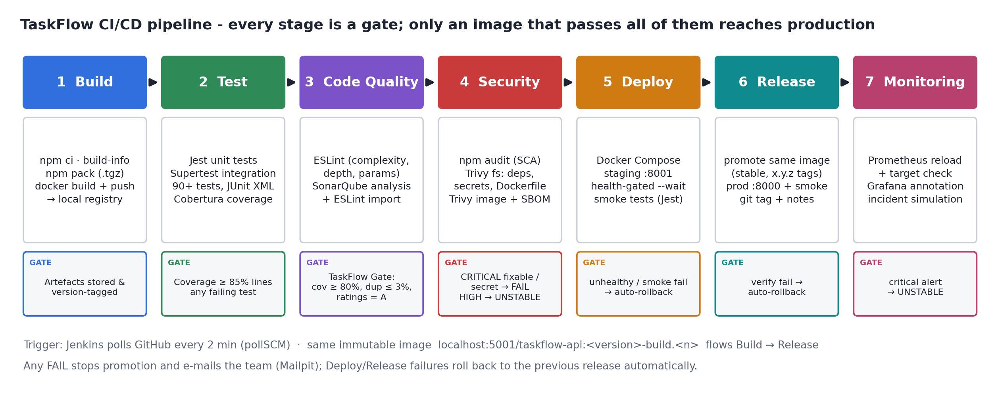
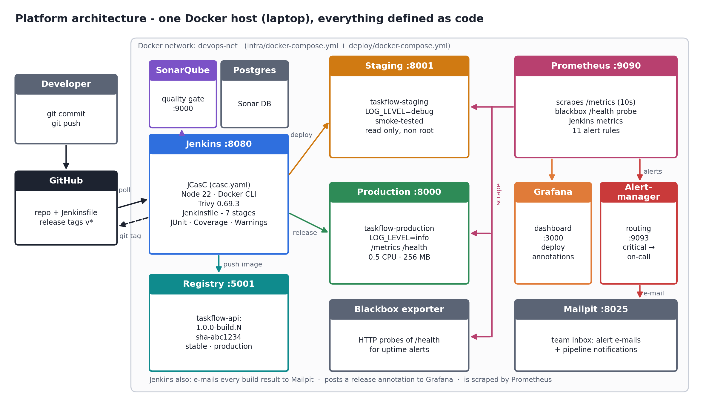

# TaskFlow API: a 7-stage Jenkins CI/CD pipeline

TaskFlow is a task-management REST API with a small web UI. It has JWT authentication, per-user task CRUD with filtering, stats, Prometheus metrics, health checks and a fault-injection endpoint. It was built to demonstrate a complete, automated delivery pipeline for **SIT753 Task 7.3HD**:

**Build → Test → Code Quality → Security → Deploy (staging) → Release (production) → Monitoring & Alerting**



| | |
|---|---|
| **App** | Node.js 22, Express 5, JWT (jsonwebtoken + bcryptjs), Joi validation, Helmet, rate limiting, pino logs, prom-client metrics |
| **CI/CD** | Jenkins LTS (Jenkinsfile + Configuration-as-Code), Docker, private Docker registry |
| **Testing** | Jest + Supertest: 90 unit/integration tests, coverage gate, plus post-deploy smoke tests |
| **Quality** | ESLint (custom complexity rules) + SonarQube with a custom quality gate |
| **Security** | npm audit, Trivy (dependencies, secrets, Dockerfile misconfigurations, container image), CycloneDX SBOM |
| **Deploy/Release** | Docker Compose environments (staging/production), health-gated deploys, automatic rollback, git release tags |
| **Monitoring** | Prometheus, Grafana, Alertmanager, blackbox exporter, Mailpit (alert inbox), incident simulation |



---

## 1. Run the whole platform (≈10 minutes, first time)

**Prerequisites:** Docker Desktop (give it **≥ 6 GB RAM** under Settings → Resources), Git, and a GitHub account.

```bash
# 1. Clone the repository
git clone https://github.com/<you>/taskflow-devops.git
cd taskflow-devops

# 2. Start Jenkins, SonarQube, the registry and the monitoring stack, all configured as code.
#    The optional user/token lets Jenkins clone a PRIVATE repo and push release tags.
./scripts/bootstrap.sh https://github.com/<you>/taskflow-devops.git <github-user> <github-personal-access-token>
```

The script prints every URL and the generated passwords. Secrets live in `infra/.env`, which is git-ignored.

| Service | URL | Login |
|---|---|---|
| Jenkins | http://localhost:8080 | `admin` / printed by bootstrap |
| SonarQube | http://localhost:9000 | `admin` / printed by bootstrap |
| Grafana | http://localhost:3000 | `admin` / printed by bootstrap |
| Prometheus | http://localhost:9090 | |
| Alertmanager | http://localhost:9093 | |
| Mailpit (team inbox) | http://localhost:8025 | |
| Staging app | http://localhost:8001 | after the first build |
| Production app | http://localhost:8000 | after the first build |

### 2. Run the pipeline

1. Open Jenkins and go to **TaskFlow CI/CD Pipeline**. The job was created automatically by `infra/jenkins/casc.yaml`.
2. Click **Build Now**. The first build runs with the default parameters; after it, the job shows **Build with Parameters**.
3. Optional parameters:
   * `REQUIRE_APPROVAL`: pauses for a manual "promote to production?" approval.
   * `SIMULATE_INCIDENT` = `error-spike` | `latency` | `outage`: injects a fault into production, waits for the Prometheus alert to fire and checks that the team was e-mailed.
4. After that, every `git push` to `main` triggers the pipeline within 2 minutes (SCM polling).

Stop everything with `./scripts/teardown.sh`, or use `./scripts/teardown.sh --purge` to delete all data as well.

---

## 3. Run the app on its own

```bash
npm ci
npm test            # unit + integration tests
npm run test:ci     # with coverage thresholds and JUnit output
npm run lint
npm start           # http://localhost:3000
```

### API

| Method | Path | Auth | Description |
|---|---|---|---|
| POST | `/api/auth/register` | | Create an account and return a JWT |
| POST | `/api/auth/login` | | Log in (rate-limited) |
| GET | `/api/auth/me` | JWT | Current user |
| GET | `/api/tasks?status=&priority=&tag=&search=&sort=&order=&page=&limit=` | JWT | List, filter, search, sort and paginate |
| POST | `/api/tasks` | JWT | Create a task |
| GET/PATCH/DELETE | `/api/tasks/:id` | JWT | Read, update (with status-transition rules) or delete |
| GET | `/api/tasks/stats` | JWT | Counts by status and priority, overdue tasks, completion rate |
| GET | `/health`, `/ready` | | Liveness and readiness |
| GET | `/api/version` | | Build metadata: version, commit, build number |
| GET | `/metrics` | | Prometheus metrics |
| GET/POST | `/api/admin/chaos` | `x-chaos-token` | Incident simulation (disabled unless `CHAOS_TOKEN` is set) |

---

## 4. Repository layout

```
Jenkinsfile                      the 7-stage pipeline
Dockerfile                       hardened multi-stage production image
src/                             application (config, routes, services, repositories, middleware, metrics)
public/                          web UI
tests/unit | integration | smoke Jest test suites
sonar-project.properties         SonarQube analysis settings
.trivyignore.yaml                accepted-risk register for security findings
deploy/                          docker-compose.yml + env/<env>.env + deploy.sh / rollback.sh
infra/docker-compose.yml         Jenkins, SonarQube, registry, Prometheus, Grafana, Alertmanager, Mailpit
infra/jenkins/                   Jenkins image, plugins.txt, casc.yaml (Configuration as Code)
infra/monitoring/                Prometheus config + alert rules, Alertmanager routes, Grafana dashboard
scripts/                         bootstrap, SonarQube setup, security gate, monitoring checks, incident simulation
docs/                            pipeline design, security report, demo script
```

More detail:

* [docs/PIPELINE.md](docs/PIPELINE.md): stage-by-stage design decisions
* [docs/SECURITY-REPORT.md](docs/SECURITY-REPORT.md): vulnerability findings and how each was handled
* [docs/DEMO-SCRIPT.md](docs/DEMO-SCRIPT.md): a plan for the 10-minute demo video
